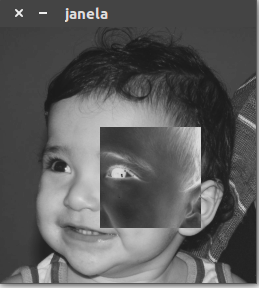

:source-highlighter: pygments 	
:stem: 

= DCA0445: Processamento Digital de Imagens
Joelson Rocha <JoelsonRocha.Eng@gmail.com>
:toc: left

== Introdução

Este espaço tem como objetivo documentar as atividades realizadas, com auxílio da biblioteca de visão artifical OpenCV, e propostas pelo professor Agostinho Medeiros Brito Júnior durante a disciplina de Processamento Digital de Imagens. Aqui são compartilhados os enunciados de cada atividade, suas fundamentações teóricas, a solução comentada e implementada, bem como a saída em terminal UNIX.

Os códigos foram desenvolvidos na linguagem de programação C++.

== 1. Unidade I ==

=== 1.1 Invertendo cores de uma região ===
O programa link:PDI/regions.cpp[regions] é capaz de receber como entrada dois pontos (stem:[\P_{1}] e stem:[\P_{2}])  que compõem um retângulo de vértices opostos. Essa região, em efeito negativo, é criada na imagem abaixo,.	
//suporte a figuras png,jpg,gif e SVG
// Link: [texto_exibido]

.Saída do programa Regions.

//INCLUIR CÓDIGO FONTE

[[exa_hello,Hello]]
[source,cpp]
.regions.cpp
----
include::PDI/regions.cpp[]
----

